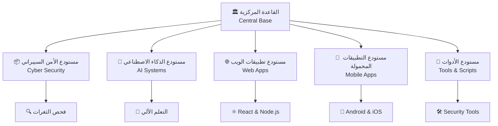

<a href="https://hellogithub.com/repository/Snapchat/Valdi" target="_blank"></a>
<div align="center">

# 🏛️ القاعدة المركزية | Central Base


---

### 🎯 **المركز الرئيسي لإدارة وربط جميع المستودعات الأمنية**

```ascii
╔══════════════════════════════════════════════════════════════╗
║                    🏛️ CENTRAL BASE SYSTEM                    ║
║                   القيادة المركزية للعمليات                  ║
╚══════════════════════════════════════════════════════════════╝
```

</div>

---

## 📋 **المقدمة | Introduction**

**القاعدة المركزية** هي نظام إدارة مركزي متقدم مصمم لربط وتنسيق جميع المستودعات الأمنية والبرمجية. تعمل كنقطة تحكم رئيسية للموافقة على الحزم، إدارة التصريحات، ومراقبة جميع العمليات الأمنية.

### 🎖️ **دور القاعدة المركزية**

- 🔗 **ربط المستودعات**: توحيد جميع المستودعات تحت إدارة مركزية واحدة
- ✅ **قبول الحزم**: الموافقة والتحقق من جميع الحزم الواردة من المصادر الخارجية
- 🛡️ **إدارة التصريحات**: منح صلاحيات الوصول والتعديل للمستودعات المختلفة
- 📊 **المراقبة المركزية**: متابعة جميع العمليات والأنشطة في الوقت الفعلي
- 🔐 **الأمن المتقدم**: تطبيق سياسات أمنية صارمة على جميع العمليات

---

## 🏗️ **البنية التحتية | Architecture**



---

## ⚙️ **المميزات الرئيسية | Key Features**

<div align="center">

| 🎯 الميزة | 📝 الوصف | ⚡ الحالة |
|:---:|:---|:---:|
| 🔗 **الربط المركزي** | ربط جميع المستودعات بنظام موحد | ✅ نشط |
| 🛡️ **الفحص الأمني** | فحص تلقائي لجميع الحزم الواردة | ✅ نشط |
| 📊 **لوحة التحكم** | واجهة إدارة شاملة للعمليات | ✅ نشط |
| 🔐 **إدارة الصلاحيات** | نظام متقدم لإدارة الوصول | ✅ نشط |
| 📡 **المراقبة الحية** | متابعة فورية لجميع الأنشطة | ✅ نشط |
| 🤖 **الأتمتة الذكية** | أتمتة المهام الروتينية بالذكاء الاصطناعي | 🚧 قيد التطوير |

</div>

---

## 📦 **الحزم المدعومة | Supported Packages**

### 🛡️ **حزم الأمن السيبراني**

```bash
npm install @central-base/security-scanner
npm install @central-base/vulnerability-detector
npm install @central-base/threat-analyzer
npm install @central-base/penetration-testing
```

### 🤖 **حزم الذكاء الاصطناعي**

```bash
npm install @central-base/ml-models
npm install @central-base/ai-threat-detection
npm install @central-base/behavioral-analysis
```

### 🌐 **حزم تطوير الويب**

```bash
npm install @central-base/react-security
npm install @central-base/api-gateway
npm install @central-base/auth-system
```

---

## 🚀 **التثبيت والإعداد | Installation & Setup**

### المتطلبات الأساسية

- Node.js >= 18.0.0
- npm >= 9.0.0
- Python >= 3.9
- Docker >= 24.0.0
- Git >= 2.40.0

### خطوات التثبيت

```bash
# 1️⃣ استنساخ المستودع
git clone https://github.com/your-org/central-base.git
cd central-base

# 2️⃣ تثبيت التبعيات
npm install

# 3️⃣ إعداد البيئة
cp .env.example .env
nano .env

# 4️⃣ تشغيل قاعدة البيانات
docker-compose up -d

# 5️⃣ تهيئة النظام
npm run setup

# 6️⃣ تشغيل القاعدة المركزية
npm run start
```

---

## 🔐 **نظام التصريحات | Authorization System**

### مستويات الوصول

```javascript
// القائد الأعلى | Supreme Commander
LEVEL_5: {
  permissions: ['*'],
  access: 'unlimited',
  repositories: 'all'
}

// قائد العمليات | Operations Commander
LEVEL_4: {
  permissions: ['read', 'write', 'approve', 'deploy'],
  access: 'high',
  repositories: 'assigned'
}

// المطور الرئيسي | Lead Developer
LEVEL_3: {
  permissions: ['read', 'write', 'review'],
  access: 'medium',
  repositories: 'assigned'
}

// المطور | Developer
LEVEL_2: {
  permissions: ['read', 'write'],
  access: 'limited',
  repositories: 'assigned'
}

// المراقب | Observer
LEVEL_1: {
  permissions: ['read'],
  access: 'view-only',
  repositories: 'public'
}
```

---

## 📊 **API المركزي | Central API**

### نقاط النهاية الرئيسية

```javascript
// 🔍 فحص حزمة جديدة
POST /api/v3/packages/scan
{
  "package": "package-name",
  "version": "1.0.0",
  "source": "npm"
}

// ✅ الموافقة على حزمة
POST /api/v3/packages/approve
{
  "packageId": "pkg_12345",
  "approver": "commander_001",
  "signature": "digital_signature"
}

// 🔗 ربط مستودع جديد
POST /api/v3/repositories/connect
{
  "name": "new-repo",
  "url": "https://github.com/org/repo",
  "accessLevel": "level_3"
}

// 📊 الحصول على تقرير الحالة
GET /api/v3/status/report
{
  "period": "24h",
  "detailed": true
}
```

---

## 🛡️ **الأمن والحماية | Security**

### البروتوكولات الأمنية

- 🔐 **التشفير من طرف إلى طرف**: AES-256-GCM
- 🔑 **إدارة المفاتيح**: HashiCorp Vault
- 🛡️ **جدار الحماية**: iptables + fail2ban
- 🔒 **المصادقة**: OAuth 2.0 + JWT + 2FA
- 🔍 **المراقبة**: ELK Stack + Prometheus
- 📝 **السجلات**: Encrypted audit logs

### سياسات الأمان

```yaml
security_policies:
  - name: "Zero Trust Architecture"
    status: enforced
    
  - name: "Least Privilege Access"
    status: enforced
    
  - name: "Continuous Monitoring"
    status: active
    
  - name: "Automated Threat Response"
    status: active
    
  - name: "Regular Security Audits"
    frequency: weekly
```

---

## 👥 **المساهمون | Contributors**

<div align="center">

### 🏆 **فريق القيادة | Command Team**

<table>
  <tr>
    <td align="center">
      <br/>
      <b>Supreme Commander</b><br/>
      <sub>Architecture & Strategy</sub>
    </td>
    <td align="center">
      <br/>
      <b>Security Commander</b><br/>
      <sub>Cybersecurity Operations</sub>
    </td>
    <td align="center">
      <br/>
      <b>Development Lead</b><br/>
      <sub>Engineering & Innovation</sub>
    </td>
  </tr>
</table>

---

### 🌟 **المساهمون النشطون**

[](https://github.com/your-org/central-base/graphs/contributors)

</div>

---

## 📈 **الإحصائيات | Statistics**

<div align="center">


</div>

---

## 🎖️ **الشارات والإنجازات | Badges & Achievements**

<div align="center">

### 🏅 **جودة الكود**

[](https://www.codacy.com)
[](https://codecov.io)
[](https://github.com)

### 🛡️ **الأمن**

[](https://snyk.io)
[](https://snyk.io)

### 📦 **الحزم**

[](https://www.npmjs.com)
[](https://www.npmjs.com)

</div>

---

## 📚 **التوثيق | Documentation**

- 📖 [**دليل المستخدم الكامل**](./docs/user-guide.md)
- 🔧 [**دليل المطور**](./docs/developer-guide.md)
- 🏛️ [**البنية المعمارية**](./docs/architecture.md)
- 🔐 [**سياسات الأمان**](./docs/security-policies.md)
- 🚀 [**دليل النشر**](./docs/deployment.md)
- 📊 [**API Documentation**](./docs/api-reference.md)

---

## 🤝 **المساهمة | Contributing**

نرحب بمساهماتكم! يرجى اتباع الخطوات التالية:

1. 🍴 Fork المستودع
2. 🌿 إنشاء فرع جديد (`git checkout -b feature/amazing-feature`)
3. ✍️ Commit التغييرات (`git commit -m 'Add amazing feature'`)
4. 📤 Push إلى الفرع (`git push origin feature/amazing-feature`)
5. 🔃 فتح Pull Request

يرجى قراءة [دليل المساهمة](./CONTRIBUTING.md) للمزيد من التفاصيل.

---

## 📜 **الترخيص | License**

<div align="center">

[](https://opensource.org/licenses/MIT)

هذا المشروع مرخص بموجب **رخصة MIT** - انظر ملف [LICENSE](./LICENSE) للتفاصيل.

```
MIT License - حرية الاستخدام والتعديل والتوزيع
```

</div>

---

## 📞 **التواصل | Contact**

<div align="center">

### 🌐 **تواصل معنا**

[](https://github.com/central-base)
[](mailto:contact@centralbase.dev)
[](https://discord.gg/centralbase)
[](https://twitter.com/centralbase)

### 🆘 **الدعم**

للحصول على الدعم، يرجى فتح [Issue](https://github.com/your-org/central-base/issues) أو الانضمام إلى [Discord Server](https://discord.gg/centralbase)

</div>

---

## 🎯 **خارطة الطريق | Roadmap**

### ✅ **الإصدار 3.0 (الحالي)**
- [x] النظام المركزي الأساسي
- [x] نظام التصريحات المتقدم
- [x] API الموحد
- [x] لوحة التحكم

### 🚧 **الإصدار 3.1 (قيد التطوير)**
- [ ] تكامل الذكاء الاصطناعي
- [ ] نظام الإنذار المبكر
- [ ] التحليل التنبؤي
- [ ] تطبيق المحمول

### 🔮 **الإصدار 4.0 (المستقبل)**
- [ ] Blockchain Integration
- [ ] Quantum-Safe Encryption
- [ ] Advanced AI Automation
- [ ] Multi-Cloud Support

---

<div align="center">

## 🌟 **شكراً لاستخدامكم القاعدة المركزية** 🌟

### 🇦🇪 **صنع بكل فخر في الإمارات العربية المتحدة** 🇦🇪

---

```ascii
╔══════════════════════════════════════════════════════════════╗
║              ⚔️  STAY SECURE. STAY VIGILANT  🛡️              ║
║                   محمي. مراقب. منظم.                        ║
╚══════════════════════════════════════════════════════════════╝
```

[](https://github.com/your-org)
[](https://uae.ae)

**© 2025 Central Base. All Rights Reserved.**

</div>


https://github.com/user-attachments/assets/ebeecec2-0f34-4a50-80a5-e7a36e2f5dd1

