<div align="center">

# 🏛️ الهيكل المعماري للقاعدة المركزية
## CENTRAL BASE ARCHITECTURE STRUCTURE


```ascii
╔═══════════════════════════════════════════════════════════════════╗
║                                                                   ║
║              🏛️  CENTRAL BASE COMMAND STRUCTURE  ⚔️               ║
║                  الهيكل القيادي للقاعدة المركزية                 ║
║                                                                   ║
║        "القيادة المركزية - حيث تلتقي جميع المستودعات"             ║
║                                                                   ║
╚═══════════════════════════════════════════════════════════════════╝
```

</div>

---

## 📋 جدول المحتويات | Table of Contents

- [🎯 نظرة عامة](#-نظرة-عامة--overview)
- [🏗️ البنية الهرمية](#️-البنية-الهرمية--hierarchical-structure)
- [📁 هيكل المجلدات](#-هيكل-المجلدات--directory-structure)
- [🔗 المستودعات المرتبطة](#-المستودعات-المرتبطة--connected-repositories)
- [📦 نظام الحزم](#-نظام-الحزم--package-system)
- [🎖️ نظام البادجات](#️-نظام-البادجات--badge-system)
- [🌐 شبكة الاتصال](#-شبكة-الاتصال--network-topology)
- [⚙️ آلية العمل](#️-آلية-العمل--workflow-mechanism)

---

## 🎯 نظرة عامة | Overview

<div align="center">

### 🏛️ **مفهوم القاعدة المركزية**

القاعدة المركزية ليست مجرد مستودع - إنها **مركز القيادة والتحكم** الذي يربط ويدير جميع المستودعات في نظام موحد متكامل.

```
         ┌─────────────────────────────────────────┐
         │      🏛️ القاعدة المركزية             │
         │       CENTRAL BASE HQ                  │
         │                                        │
         │  "المركز الرئيسي لجميع العمليات"      │
         └─────────────────────────────────────────┘
                          │
          ┌───────────────┼───────────────┐
          ▼               ▼               ▼
     ┌─────────┐    ┌─────────┐    ┌─────────┐
     │ REPOS   │    │ PACKAGES│    │ BADGES  │
     │ 🗂️      │    │ 📦      │    │ 🎖️      │
     └─────────┘    └─────────┘    └─────────┘
```

</div>

### 🎖️ المهام الرئيسية

| 🔢 | 🎯 المهمة | 📝 الوصف |
|:---:|:---|:---|
| 1️⃣ | **ربط المستودعات** | توحيد جميع المستودعات تحت إدارة مركزية |
| 2️⃣ | **إدارة الحزم** | التحكم في توزيع ونشر الحزم البرمجية |
| 3️⃣ | **نظام البادجات** | إصدار وإدارة شارات التحقق والجودة |
| 4️⃣ | **المراقبة المركزية** | متابعة حالة جميع المستودعات |
| 5️⃣ | **التكامل الآلي** | أتمتة العمليات بين المستودعات |

---

## 🏗️ البنية الهرمية | Hierarchical Structure

<div align="center">

### 🔺 الهرم القيادي

```
                          👑
                      ┌─────────┐
                      │ Level 5 │
                      │ القائد  │
                      │ Supreme │
                      └────┬────┘
                           │
              ┌────────────┼────────────┐
              ▼                         ▼
         ┌─────────┐              ┌─────────┐
         │ Level 4 │              │ Level 4 │
         │ العمليات│              │ الأمن   │
         │Operations│             │Security │
         └────┬────┘              └────┬────┘
              │                        │
      ┌───────┼───────┐        ┌──────┼──────┐
      ▼       ▼       ▼        ▼      ▼      ▼
   [Dev]  [Test]  [Deploy] [Scan] [Audit] [Monitor]
   Level3  Level3  Level3   Level3 Level3  Level3
```

### 📊 مستويات الوصول

| المستوى | الرتبة | الصلاحيات | المستودعات |
|:---:|:---|:---|:---:|
| 🌟🌟🌟🌟🌟 | Supreme Commander | كل الصلاحيات | ALL |
| 🌟🌟🌟🌟 | Operations Commander | إدارة + نشر | Assigned |
| 🌟🌟🌟 | Lead Developer | قراءة + كتابة + مراجعة | Assigned |
| 🌟🌟 | Developer | قراءة + كتابة | Limited |
| 🌟 | Observer | قراءة فقط | Public |

</div>

---

## 📁 هيكل المجلدات | Directory Structure

### 🗂️ البنية الكاملة للمستودع

```
central-base/
│
├── 📋 README.md                    # الواجهة الرئيسية
├── 🛡️ SECURITY.md                 # سياسة الأمن السيبراني
├── 🏗️ STRUCTURE.md                # الهيكل المعماري (هذا الملف)
├── 📜 LICENSE                      # Apache 2.0
├── 📝 CHANGELOG.md                 # سجل التغييرات
├── 🤝 CONTRIBUTING.md              # دليل المساهمة
├── ❓ FAQ.md                       # الأسئلة الشائعة
│
├── 📂 .github/                     # إعدادات GitHub
│   ├── workflows/                  # GitHub Actions
│   │   ├── 🔄 ci.yml              # التكامل المستمر
│   │   ├── 🚀 deploy.yml          # النشر التلقائي
│   │   ├── 🛡️ security-scan.yml   # الفحص الأمني
│   │   ├── 📦 package-check.yml   # فحص الحزم
│   │   └── 🎖️ badge-update.yml    # تحديث البادجات
│   │
│   ├── ISSUE_TEMPLATE/             # قوالب المشاكل
│   │   ├── bug_report.md
│   │   ├── feature_request.md
│   │   └── security_report.md
│   │
│   ├── PULL_REQUEST_TEMPLATE.md    # قالب الـ PR
│   ├── CODEOWNERS                  # مالكي الكود
│   └── dependabot.yml              # إعدادات Dependabot
│
├── 📂 src/                         # الكود المصدري
│   ├── 🏛️ core/                   # النواة الأساسية
│   │   ├── central-hub.js         # المحور المركزي
│   │   ├── repo-connector.js      # موصل المستودعات
│   │   ├── package-manager.js     # مدير الحزم
│   │   └── badge-generator.js     # مولد البادجات
│   │
│   ├── 🔗 connectors/             # موصلات المستودعات
│   │   ├── github-connector.js
│   │   ├── gitlab-connector.js
│   │   ├── npm-connector.js
│   │   └── docker-connector.js
│   │
│   ├── 📦 packages/                # إدارة الحزم
│   │   ├── scanner.js             # فاحص الحزم
│   │   ├── validator.js           # مدقق الحزم
│   │   ├── distributor.js         # موزع الحزم
│   │   └── registry.js            # سجل الحزم
│   │
│   ├── 🎖️ badges/                 # نظام البادجات
│   │   ├── generator.js           # مولد البادجات
│   │   ├── templates.js           # قوالب البادجات
│   │   ├── verifier.js            # مدقق البادجات
│   │   └── registry.js            # سجل البادجات
│   │
│   ├── 🛡️ security/               # الأمن السيبراني
│   │   ├── scanner.js             # فاحص الثغرات
│   │   ├── monitor.js             # المراقب الأمني
│   │   ├── firewall.js            # جدار الحماية
│   │   └── audit-logger.js        # مسجل التدقيق
│   │
│   ├── 📊 analytics/               # التحليلات
│   │   ├── metrics-collector.js   # جامع المقاييس
│   │   ├── dashboard.js           # لوحة المعلومات
│   │   └── reporter.js            # مولد التقارير
│   │
│   └── 🤖 automation/              # الأتمتة
│       ├── scheduler.js           # المجدول
│       ├── auto-updater.js        # المحدث التلقائي
│       └── ci-cd-manager.js       # مدير CI/CD
│
├── 📂 config/                      # ملفات الإعدادات
│   ├── central.config.js          # الإعدادات المركزية
│   ├── repositories.json          # قائمة المستودعات
│   ├── packages.json              # إعدادات الحزم
│   ├── badges.json                # إعدادات البادجات
│   ├── security.json              # السياسات الأمنية
│   └── environments/              # بيئات مختلفة
│       ├── development.json
│       ├── staging.json
│       └── production.json
│
├── 📂 data/                        # قاعدة البيانات
│   ├── 🗂️ repositories/           # بيانات المستودعات
│   │   ├── registry.json          # سجل المستودعات
│   │   ├── connections.json       # الاتصالات النشطة
│   │   └── metadata/              # معلومات تفصيلية
│   │
│   ├── 📦 packages/                # بيانات الحزم
│   │   ├── approved.json          # الحزم المعتمدة
│   │   ├── pending.json           # قيد المراجعة
│   │   └── rejected.json          # المرفوضة
│   │
│   ├── 🎖️ badges/                 # بيانات البادجات
│   │   ├── issued.json            # البادجات الصادرة
│   │   ├── templates.json         # القوالب
│   │   └── verification.json      # التحققات
│   │
│   └── 📊 logs/                   # السجلات
│       ├── activity/              # سجلات النشاط
│       ├── security/              # سجلات الأمن
│       └── errors/                # سجلات الأخطاء
│
├── 📂 docs/                        # التوثيق
│   ├── 📖 user-guide/             # دليل المستخدم
│   │   ├── getting-started.md
│   │   ├── basic-usage.md
│   │   └── advanced-features.md
│   │
│   ├── 👨‍💻 developer-guide/        # دليل المطور
│   │   ├── architecture.md
│   │   ├── api-reference.md
│   │   └── contribution-guide.md
│   │
│   ├── 🏛️ architecture/           # الهندسة المعمارية
│   │   ├── system-design.md
│   │   ├── data-flow.md
│   │   └── integration.md
│   │
│   └── 📊 api/                    # توثيق API
│       ├── rest-api.md
│       ├── graphql-api.md
│       └── webhooks.md
│
├── 📂 tests/                       # الاختبارات
│   ├── unit/                      # اختبارات الوحدة
│   ├── integration/               # اختبارات التكامل
│   ├── e2e/                       # اختبارات شاملة
│   └── security/                  # اختبارات أمنية
│
├── 📂 scripts/                     # السكريبتات
│   ├── setup.sh                   # إعداد النظام
│   ├── deploy.sh                  # النشر
│   ├── backup.sh                  # النسخ الاحتياطي
│   └── maintenance.sh             # الصيانة
│
├── 📂 tools/                       # الأدوات المساعدة
│   ├── cli/                       # أدوات سطر الأوامر
│   ├── generators/                # المولدات
│   └── validators/                # المدققات
│
├── 📂 templates/                   # القوالب
│   ├── repository/                # قوالب المستودعات
│   ├── package/                   # قوالب الحزم
│   └── badge/                     # قوالب البادجات
│
├── 📂 public/                      # الملفات العامة
│   ├── assets/                    # الأصول
│   │   ├── images/
│   │   ├── icons/
│   │   └── logos/
│   │
│   └── dashboard/                 # لوحة التحكم
│       ├── index.html
│       ├── styles/
│       └── scripts/
│
├── 📂 examples/                    # أمثلة الاستخدام
│   ├── basic-connection.js
│   ├── package-management.js
│   └── badge-generation.js
│
├── 📄 package.json                 # تبعيات Node.js
├── 📄 package-lock.json
├── 📄 .gitignore
├── 📄 .dockerignore
├── 📄 Dockerfile                   # صورة Docker
├── 📄 docker-compose.yml           # تكوين Docker
├── 📄 .env.example                 # مثال متغيرات البيئة
└── 📄 .eslintrc.json              # إعدادات ESLint
```

---

## 🔗 المستودعات المرتبطة | Connected Repositories

<div align="center">

### 🌐 شبكة المستودعات المتكاملة

```mermaid
graph TB
    CB[🏛️ Central Base<br/>القاعدة المركزية]
    
    CB --> SR[🛡️ Security Repos<br/>مستودعات الأمن]
    CB --> DR[👨‍💻 Development Repos<br/>مستودعات التطوير]
    CB --> TR[🧪 Testing Repos<br/>مستودعات الاختبار]
    CB --> UR[📱 UI/UX Repos<br/>مستودعات الواجهات]
    CB --> AR[🤖 AI/ML Repos<br/>مستودعات الذكاء الاصطناعي]
    
    SR --> SR1[Penetration Tools]
    SR --> SR2[Vulnerability Scanner]
    SR --> SR3[Security Audit]
    
    DR --> DR1[Web Apps]
    DR --> DR2[Mobile Apps]
    DR --> DR3[Backend Services]
    
    TR --> TR1[Unit Tests]
    TR --> TR2[Integration Tests]
    TR --> TR3[E2E Tests]
    
    UR --> UR1[React Components]
    UR --> UR2[Vue Templates]
    UR --> UR3[Design System]
    
    AR --> AR1[ML Models]
    AR --> AR2[Data Analysis]
    AR --> AR3[AI Agents]
    
    style CB fill:#FFD700,stroke:#000,stroke-width:4px
    style SR fill:#dc143c,stroke:#000,stroke-width:2px
    style DR fill:#4169e1,stroke:#000,stroke-width:2px
    style TR fill:#32cd32,stroke:#000,stroke-width:2px
    style UR fill:#ff69b4,stroke:#000,stroke-width:2px
    style AR fill:#9370db,stroke:#000,stroke-width:2px
```



</div>

### 📊 تصنيف المستودعات

<table align="center">
<tr>
<th>🏷️ الفئة</th>
<th>📝 الوصف</th>
<th>🔢 العدد</th>
<th>🎖️ البادج</th>
</tr>

<tr>
<td><b>🛡️ الأمن السيبراني</b></td>
<td>أدوات الحماية والاختراق</td>
<td align="center">15</td>
<td></td>
</tr>

<tr>
<td><b>👨‍💻 التطوير</b></td>
<td>تطبيقات ويب ومحمول</td>
<td align="center">23</td>
<td></td>
</tr>

<tr>
<td><b>🧪 الاختبار</b></td>
<td>أطر اختبار ومراجعة</td>
<td align="center">8</td>
<td></td>
</tr>

<tr>
<td><b>📱 الواجهات</b></td>
<td>مكونات UI/UX</td>
<td align="center">12</td>
<td></td>
</tr>

<tr>
<td><b>🤖 الذكاء الاصطناعي</b></td>
<td>نماذج ML وتحليل بيانات</td>
<td align="center">10</td>
<td></td>
</tr>

<tr>
<td><b>📚 التوثيق</b></td>
<td>أدلة ووثائق</td>
<td align="center">5</td>
<td></td>
</tr>

<tr>
<td><b>🔧 الأدوات</b></td>
<td>أدوات مساعدة وسكريبتات</td>
<td align="center">18</td>
<td></td>
</tr>

<tr>
<td colspan="2"><b>📊 الإجمالي</b></td>
<td align="center"><b>91</b></td>
<td></td>
</tr>
</table>

---

## 📦 نظام الحزم | Package System

### 🔄 دورة حياة الحزمة

```
┌─────────────────────────────────────────────────────────────┐
│                    📦 Package Lifecycle                     │
└─────────────────────────────────────────────────────────────┘

    1. SUBMISSION          2. SCANNING           3. REVIEW
    ┌──────────┐          ┌──────────┐          ┌──────────┐
    │ Developer│          │ Auto Scan│          │  Warrior │
    │ Submits  │  ───>    │ Security │  ───>    │  Manual  │
    │ Package  │          │  Check   │          │  Review  │
    └──────────┘          └──────────┘          └──────────┘
                                                      │
                                    ┌─────────────────┴─────────────────┐
                                    ▼                                   ▼
                            4. APPROVE                          5. REJECT
                          ┌──────────┐                        ┌──────────┐
                          │ ✅ Badge │                        │ ❌ Reason│
                          │ Issued   │                        │ Provided │
                          └────┬─────┘                        └──────────┘
                               │
                               ▼
                        6. DISTRIBUTION
                          ┌──────────┐
                          │ 🌐 Deploy│
                          │ to Repos │
                          └──────────┘
```

### 📋 معايير قبول الحزم

| ✅ المعيار | 📝 الوصف | 🎯 المستوى |
|:---|:---|:---:|
| **الأمان** | خالية من الثغرات | 🔴 حرج |
| **جودة الكود** | تتبع معايير الكود | 🟠 عالي |
| **التوثيق** | موثقة بشكل كامل | 🟡 متوسط |
| **الاختبارات** | تغطية > 80% | 🟠 عالي |
| **الترخيص** | متوافقة مع MIT/Apache | 🔴 حرج |
| **الأداء** | محسنة وسريعة | 🟡 متوسط |

### 🏷️ تصنيف الحزم

```yaml
Categories:
  🛡️ Security:
    - Vulnerability Scanners
    - Penetration Tools
    - Encryption Libraries
    - Authentication Systems
    
  🌐 Web Development:
    - React Components
    - Vue Templates
    - Node.js Middleware
    - API Frameworks
    
  📱 Mobile Development:
    - React Native Modules
    - Flutter Packages
    - Native Plugins
    
  🤖 AI & Machine Learning:
    - ML Models
    - Data Processing
    - Neural Networks
    
  🔧 DevOps:
    - CI/CD Tools
    - Monitoring Systems
    - Deployment Scripts
    
  📊 Analytics:
    - Data Visualization
    - Metrics Collection
    - Reporting Tools
```

---

## 🎖️ نظام البادجات | Badge System

<div align="center">

### 🏅 أنواع البادجات المتاحة

</div>

#### 1️⃣ بادجات الأمن | Security Badges

```
┌────────────────────────────────────────────────────────────┐
│                    🛡️ SECURITY BADGES                      │
├────────────────────────────────────────────────────────────┤
│                                                            │
│  🔴 Critical Security    - الأمان الحرج                    │
│  🟠 High Security        - الأمان العالي                   │
│  🟡 Medium Security      - الأمان المتوسط                  │
│  🟢 Basic Security       - الأمان الأساسي                  │
│  ✅ Security Verified    - تم التحقق أمنياً                │
│  🛡️ Penetration Tested  - تم اختبار الاختراق              │
│                                                            │
└────────────────────────────────────────────────────────────┘
```


#### 2️⃣ بادجات الجودة | Quality Badges

```
┌────────────────────────────────────────────────────────────┐
│                    ⭐ QUALITY BADGES                        │
├────────────────────────────────────────────────────────────┤
│                                                            │
│  🏆 Gold Quality         - جودة ذهبية A+                   │
│  🥈 Silver Quality       - جودة فضية A                     │
│  🥉 Bronze Quality       - جودة برونزية B                  │
│  ✅ Quality Assured      - مضمونة الجودة                   │
│  📊 Well Documented      - موثقة جيداً                     │
│  🧪 Fully Tested         - مختبرة بالكامل                  │
│                                                            │
└────────────────────────────────────────────────────────────┘
```


#### 3️⃣ بادجات الترخيص | License Badges

```
┌────────────────────────────────────────────────────────────┐
│                    📜 LICENSE BADGES                       │
├────────────────────────────────────────────────────────────┤
│                                                            │
│  📜 Apache 2.0           - Apache License 2.0             │
│  📜 MIT License          - MIT License                    │
│  📜 GPL v3               - GNU GPL v3                     │
│  📜 BSD License          - BSD License                    │
│  ✅ License Compliant    - متوافق مع الترخيص              │
│  🔓 Open Source          - مفتوح المصدر                   │
│                                                            │
└────────────────────────────────────────────────────────────┘
```


#### 4️⃣ بادجات الحالة | Status Badges

```
┌────────────────────────────────────────────────────────────┐
│                    ⚡ STATUS BADGES                        │
├────────

